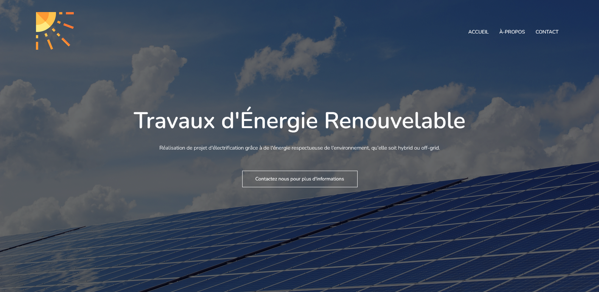

# Showcase website for PV systems installation freelancer.

## Overview
This project is a simple showcase website. It has three pages; index.html, about.html and contact.html. These three can be accessed respectively via the navbar links, ACCUEIL, A-PROPOS and CONTACT. As you may notice the texts of the website are in french.

### Screenshot

### Links

- Live Site URL:

## My process

### Built with
- HTML5
- CSS3
- JavaScript

### Continued development 

I found some difficulties in using Javascript to make some sections of the website functional such as the navbar and the slideshow. This why, I aim to focus more on how to implement Javascript. 

### Useful resources

- [functional contact form using only HTML](https://formsubmit.co/)- This helped me implement a contact form without having to use any Javascript or any backend.  
- [Slideshow used in this project](https://www.w3schools.com/howto/howto_js_slideshow.asp) - I used this example from w3schools to implement my slideshow.

## Author
- LinkedIn - [Mahmoud Guefri](https://www.linkedin.com/in/mahmoud-guefri-6b0269193/)

## Acknowledgments
A special thanks to the people behind the examples I used for creating this project: 
- This website is mostly inspired by following [Web Dev Simplified's tutorial video on how to make a website using HTML & CSS](https://www.youtube.com/watch?v=oYRda7UtuhA&list=WL&index=5&t=2215s) with some changes to fit the theme. 
- I've got to know about the formsubmit.co website through [Ania Kubów's tutorial video](https://www.youtube.com/watch?v=r4RQ38EoLds&t=323s).
- This README.md template is from the downloadable projects of [Frontend Mentor](https://www.frontendmentor.io/)